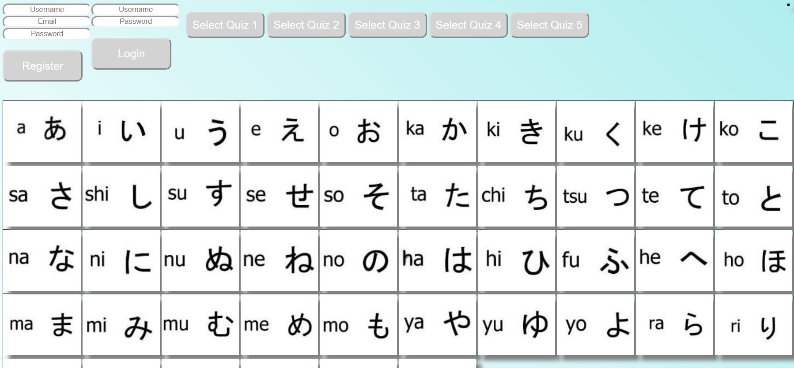
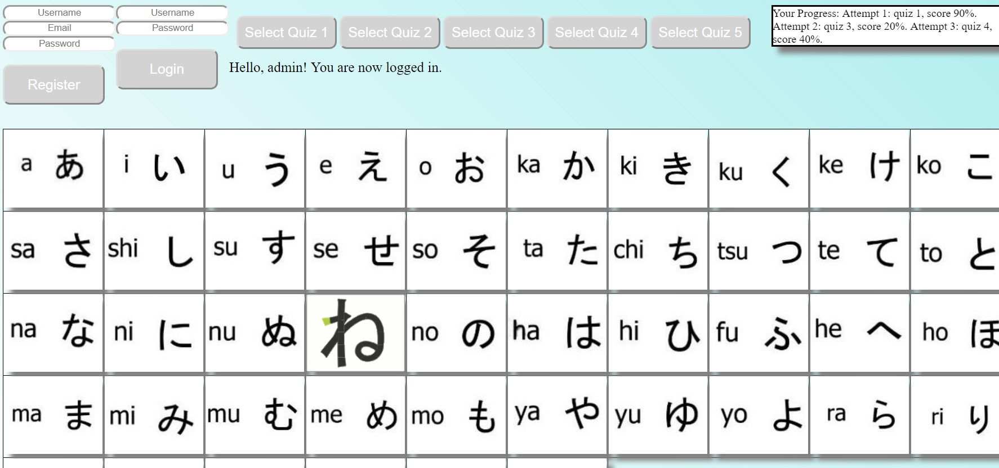
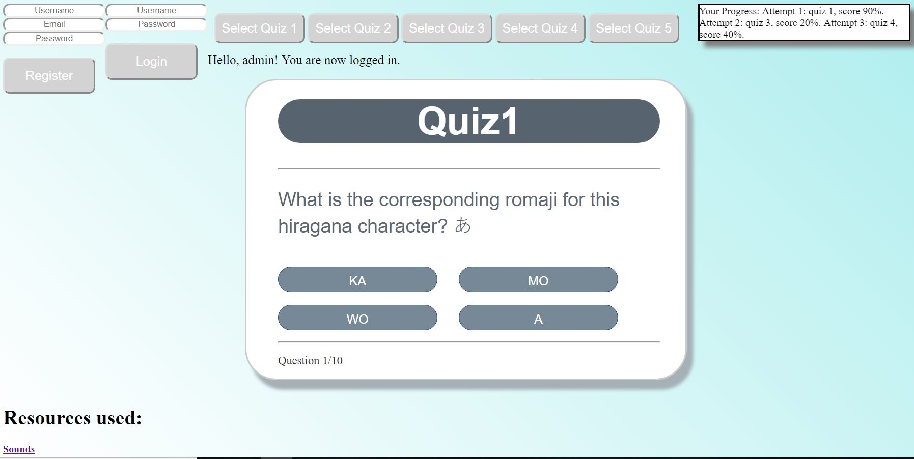
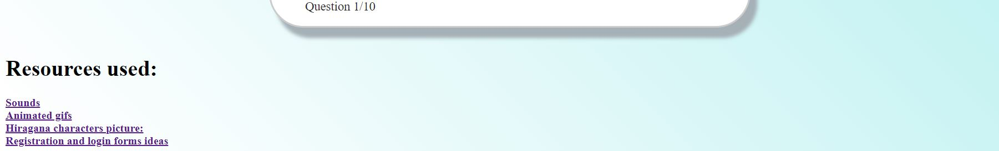

# Hiragana-Learning-SPA
This SPA helps you practice writing, pronouncing and recognizing hiragana characters and their corresponding romaji equivalents.
A hiragana table is displayed on screen.

Hover the mouse on top of a character to see how it's written or click on a character to listen to its pronunciation.
You can register to save your score and then login to see your progress displayed on screen. 

You can check your skills by completing any of the 5 quizes provided by the app. Your score is displayed after you've completed a quiz.

All references to the resources used to make this app are displayed at the bottom of the app page with the links provided accordingly.

 
<b>Files for communicating with a database:</b>

db_config.php    (set up a connection to a database)

login.php        (user login)

register.php     (user registration)

addScore.php     (to save score after completing a quiz)

loadresults.php  (to display user progress on screen)

<b>Table in a database:</b>

hiragana.sql     (SQL file to create a table in a database)

<b>Front-end and multimedia files:</b>

GitHub           (folder with all multimedia files used in the app(pictures, sounds, animations, etc)

idex.php         (front-end)

style1.css       (front-end styling)

